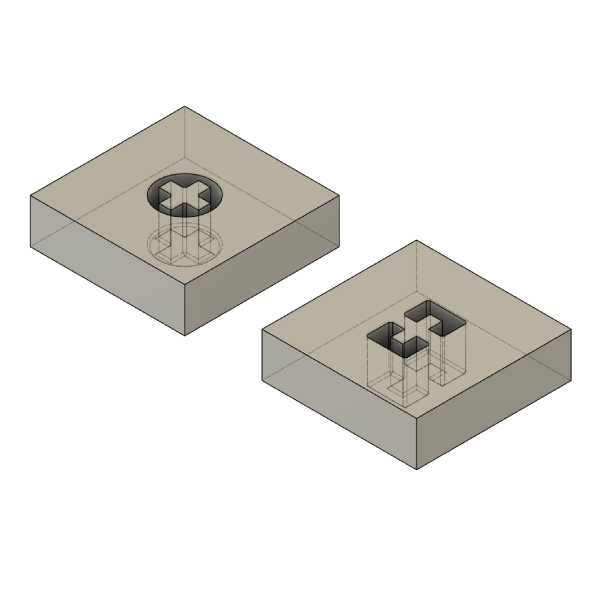

# ichi mx toolkit

ichi mx 基板を使用したキーボードをモデリングするためのデータを配布します。

## 利用規約

- 3D モデルのライセンスは CC BY 4.0 です。詳しくは下部のライセンスの条項を見て下さい。
- CC にもある通り、このデータを使用した場合に起こり得る一切の不利益・事故など全てにおいて保証はされません。
- 3D モデルはある程度の製造誤差を考えて設計していますが、モデルそのものや製造する機械・素材によって誤差は異なります。
- 3D モデルを参考にして同じような基板を作った場合、お会いしたときによかったら 1 枚下さい。

## キーマップの書き換え

Remap/via 用の JSON ファイルです。

[ichi_mx.json](firmware/ichi_mx/ichi_mx.json)

## 3D モデル

ichi mx のケースとキーキャップを作成するための補助として使える 3D モデルを用意しています。  
STEP ファイル・FBX ファイルともに同じ内容です。使いやすい形式のものをご利用下さい。  
もし、他のファイル形式が必要な場合は追加しますので、ご連絡ください。

### 3D モデルに含まれているもの

#### ichi_mx_publish

ichi mx 基板とスイッチのモデルです。ある程度正確ですがスイッチや USB コネクタは簡易的なものです。

#### ichi mx simple case と cap

- case  
  最小構成で作られたケースです。  
  内部構造やケース上面(スイッチがひっかかるところ・プレート部)を変更しなければ、モデリングのスタートポイントとしても最適です。また、`_printable`は 3D プリンタで出力するためにフィレットや面取りがされています。

- cap  
  キーキャップ側の最小構成データです。  
  `_ffm`は家庭用 3D プリンタで出力するときに出力しやすいステム形状をしています。BOX タイプのステムを持つスイッチでは使用できないので注意して下さい。

#### case_inner

ichi mx 基板の取り付けに必要なケースの内部構造です。  
作成した 3D モデルからこの部分をくり抜くことで ichi mx 基板をとりつけられるようになります。  
ケース上面の高さや USB コネクタ部のケース厚みなどは`simple_case`も一緒に参照して下さい。

#### cap_inner

キーキャップの内部構造+ステム形状です。こちらも`_ffm`は家庭用 3D プリンタ向けです。  
光造形などの場合はサフィックスのないものを利用して下さい。

#### space

USB ケーブルをとりつけるためのスペースとスイッチが押し込まれた場合に必要なスペースの参考用です。

## ライセンス

### 3D モデル

(c) 2025 Takuya Urakawa, 5z6p Instruments

このリポジトリにある 3D モデルやデータは全て Creative Commons BY 4.0 の下でライセンスされ、利用いただけます。  
ライセンスにある通り、著作権者表示をしていただければ、商用・改変など自由にお使い下さい。

### ファームウェア

`firmware/`以下のファイルは元著作物の[ch55xduino](https://github.com/ch55xduino/ch55xduino)を継承して、GNU Lesser General Public License v2.1 でライセンスされます。

https://www.gnu.org/licenses/old-licenses/lgpl-2.1.html

## 連絡先

info[at]5z6p.com、各種 SNS(@hsgw)、または 5z6p Instruments のディスコードサーバーの`ichi_mx`チャンネルまでお願いします。
